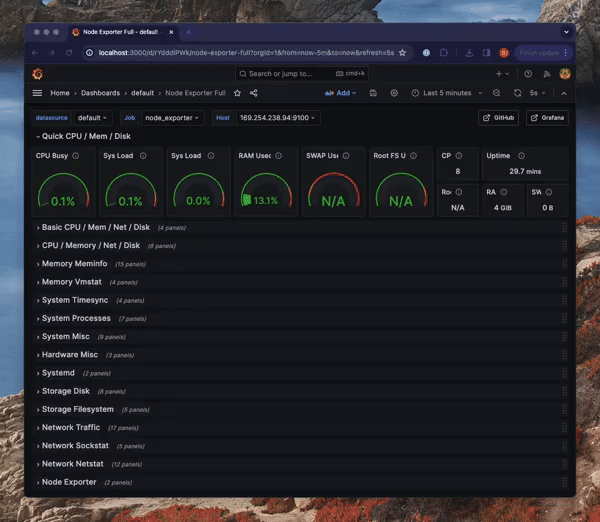

# BrightSign Prometheus Node Exporter Playground

A step-by-step guide to set up monitoring for BrightSign players using Prometheus Node Exporter and Grafana.



## What is this project?

This playground provides everything you need to:
1. Enable and collect metrics from your BrightSign players
2. Store these metrics in Prometheus 
3. Visualize the data in pre-configured Grafana dashboards

## Prerequisites

- A computer with internet access (macOS, Windows, or Linux)
- A BrightSign player running BOS 9.0.126 or later
- The player must be accessible on your local network

## Quick Setup Guide

### Step 1: Install Docker

Docker is required to run the monitoring services. If you already have Docker installed, you can skip this step.

**Option 1: Install Docker Desktop (Recommended for beginners)**
1. Visit [Docker Desktop](https://docs.docker.com/desktop/)
2. Download the installer for your operating system (macOS, Windows, or Linux)
3. Run the installer and follow the on-screen instructions
4. Start Docker Desktop after installation

**Option 2: Install Docker Engine and Docker Compose separately**
1. Install [Docker Engine](https://docs.docker.com/engine/install/) for your OS
2. Install [Docker Compose](https://docs.docker.com/compose/install/)

After installation, verify Docker is working by opening a terminal/command prompt and running:
```bash
docker --version
docker compose version
```

### Alternative Setup (Without Docker)

If you prefer not to use Docker, you can manually install and run Prometheus and Grafana on your system.

#### Step 1: Install Prometheus
1. Download the latest Prometheus release for your OS from [Prometheus Downloads](https://prometheus.io/download/).
2. Extract the archive and move it to a desired directory.
3. Edit the `prometheus.yml` file and update the `scrape_configs` section with your BrightSign player’s IP address:
      ```yaml
      - job_name: 'node_exporter'
        static_configs:
             - targets: ['YOUR_BRIGHTSIGN_IP:9100']
      ```
4. Start Prometheus by running:
      ```bash
      ./prometheus --config.file=prometheus.yml
      ```
5. Verify Prometheus is running by opening:
      ```
      http://localhost:9090/targets
      ```

#### Step 2: Install Grafana
1. Download Grafana from [Grafana Downloads](https://grafana.com/grafana/download).
2. Follow the installation steps for your OS.
3. Start Grafana by running:
      ```bash
      grafana-server
      ```
4. Open a browser and navigate to:
      ```
      http://localhost:3000
      ```
5. Log in with default credentials (`admin` / `admin`) and add Prometheus as a data source.

#### Step 3: Import the Dashboard
1. In Grafana, go to “Dashboards” → “Import.”
2. Upload the provided JSON file or enter the dashboard ID.
3. Select Prometheus as the data source.

### Step 2: Download or Clone This Repository

If you're viewing this on GitHub:
1. Click the green "Code" button
2. Select "Download ZIP"
3. Extract the ZIP file to a location of your choice

Or using git (if installed):
```bash
git clone bs-playground-prometheusNodeExporter
cd bs-playground-prometheusNodeExporter
```

### Step 3: Enable Prometheus Node Exporter on Your BrightSign Player

1. Access your BrightSign player's command shell (either via [shell access](https://brightsign.atlassian.net/wiki/spaces/DOC/pages/1988100153/BrightSign+Shell#Accessing-the-BrightSign-Shell), [telnet](https://brightsign.atlassian.net/wiki/spaces/DOC/pages/1988100153/BrightSign+Shell#Telnet), [SSH](https://brightsign.atlassian.net/wiki/spaces/DOC/pages/1988100153/BrightSign+Shell#SSH), or the Diagnostics Web Server terminal in the registry teb of BA:connected or the local DWS UI)
2. Run the following command in one of the suggested access points above to enable the Prometheus Node Exporter:
   ```bash
   registry write networking prometheus-node-exporter-port 9100
   ```
3. Reboot your BrightSign player:
   ```bash
   reboot
   ```

### Step 4: Verify the Node Exporter is Working

1. Find the IP address of your BrightSign player on your local network. This can be seen when booting up the player without an SD card inserted.
2. In a web browser, navigate to `http://<your-brightsign-ip>:9100/metrics`
3. You should see a page of text data - this confirms the Node Exporter is running correctly

   Alternatively, you can verify using curl in your terminal:
   ```bash
   curl http://<your-brightsign-ip>:9100/metrics | head -10
   ```
   This will show the first 10 lines of metrics data.

### Step 5: Configure Prometheus to Monitor Your BrightSign Player

1. Open the file `prometheus/prometheus.yml` in a text editor
2. Find the section under `scrape_configs` with `job_name: 'node_exporter'`
3. Replace the example IP `169.254.238.94` with your BrightSign player's IP address:
   ```yaml
   - job_name: 'node_exporter'
     static_configs:
       - targets: ['YOUR_BRIGHTSIGN_IP:9100']
         labels:
           model: 'YOUR_BRIGHTSIGN_MODEL'  # Optional: replace with your actual model
   ```
4. Save the file

### Step 6: Start the Monitoring Services

1. Open a terminal/command prompt
2. Navigate to the directory containing the `docker-compose.yml` file
3. Run the following command:
   ```bash
   docker compose up -d
   ```
   The `-d` flag runs the containers in the background

4. Verify Prometheus is running by opening your browser to:
   ```
   http://localhost:9090/targets
   ```
   You should see your BrightSign player listed under the "node_exporter" job with a "State" of "UP".

   You can also check via curl:
   ```bash
   curl -s "http://localhost:9090/api/v1/targets" | grep "node_exporter"
   ```

### Step 7: Access Grafana Dashboard

1. Open your web browser and navigate to:
   ```
   http://localhost:3000
   ```
   
   You can verify Grafana is running with curl:
   ```bash
   curl -I http://localhost:3000
   ```
   You should see "HTTP/1.1 200 OK" or a redirect to the login page.

2. Log in using the default credentials:
   - Username: `admin`
   - Password: `grafana`
   (You can change these in the `docker-compose.yml` file for better security)

3. After logging in, click on "Home" in the left sidebar
4. Click on "Dashboards"
5. Navigate to "Default" → "Full Node Exporter" to see your BrightSign metrics dashboard

## Basic Troubleshooting

- **No metrics in Grafana?** Verify your player is running and accessible at http://YOUR_BRIGHTSIGN_IP:9100/metrics
- **Services not starting?** Make sure Docker is running with `docker ps`
- **Dashboard not showing?** Check Prometheus is scraping your player at http://localhost:9090/targets

You can run these verification commands to check each component:

```bash
# Check if your BrightSign Node Exporter is responding
curl -s http://YOUR_BRIGHTSIGN_IP:9100/metrics | head -5

# Check if Prometheus is running and collecting data
curl -s http://localhost:9090/api/v1/query?query=up | grep -o '"value":\[.*\]'

# Check if Grafana is running
curl -I http://localhost:3000
```

---

# Additional Information

The sections below provide more details about the project. Reading them is not required to get started but may be helpful as you continue using the tool.  

## Dashboard Details

The included Grafana dashboard ("Full Node Exporter") provides comprehensive monitoring for your BrightSign players, including:

- CPU usage and load metrics
- Memory usage and allocation
- Disk space and I/O operations
- Network traffic and connectivity
- System uptime and processes

## Project Structure

```
├── demo.gif                # Demo animation showing the dashboard
├── docker-compose.yml      # Docker configuration for Prometheus and Grafana
├── grafana/                # Grafana configuration directory
│   ├── dashboards/         # Dashboard configuration
│   └── datasources/        # Data source configuration
├── prometheus/             # Prometheus configuration directory
│   └── prometheus.yml      # Prometheus scraping configuration
└── README.md               # This documentation file
```

## Monitoring Multiple Players

To monitor multiple BrightSign players, simply add more entries to the `prometheus.yml` file:

```yaml
- job_name: 'node_exporter'
  static_configs:
    - targets: ['PLAYER1_IP:9100']
      labels:
        model: 'XT1144'
        location: 'Lobby'
    - targets: ['PLAYER2_IP:9100']
      labels:
        model: 'XD1033'
        location: 'Conference Room'
```

## Common BrightSign Metrics to Monitor

Some key metrics to watch for BrightSign players:

- **Disk Space**: Especially important for players storing large media files
- **Memory Usage**: Can indicate issues with complex presentations
- **Network Traffic**: Useful for players streaming content or receiving updates

## Advanced Troubleshooting

### Docker Issues
- If containers won't start, try `docker compose down` followed by `docker compose up -d`
- Check logs with `docker logs prometheus` or `docker logs grafana`

### Prometheus Issues
- Go to Status → Targets to see if your BrightSign player is being scraped successfully
- If the player shows as "Down", verify the IP address and connectivity

### Grafana Issues
- If you don't see data in Grafana, check that Prometheus is showing as a valid data source
- Go to Configuration → Data Sources to verify

### BrightSign Issues
- Try rebooting the player if metrics aren't showing
- Check if any firewalls might be blocking the connection

## Stopping the Services

To stop the monitoring services:
```bash
docker compose down
```

To stop and remove all data:
```bash
docker compose down -v
```

## Security Considerations

This setup is intended for local development and testing. For production:

1. Change the default Grafana password in `docker-compose.yml`:
   ```yaml
   - GF_SECURITY_ADMIN_USER=admin
   - GF_SECURITY_ADMIN_PASSWORD=grafana
   ```

2. Consider adding authentication to Prometheus and restricting network access

## Frequently Asked Questions

### How often does Prometheus collect data?
By default, this setup collects metrics every 5 seconds as configured in `prometheus.yml`.

### Can I monitor players across different networks?
Yes, but you'll need to ensure network connectivity between your monitoring server and the players, which may require VPN or other networking solutions.

### Will this work with all BrightSign models?
This should work with any BrightSign player running BOS 9.0.126 or later, which includes the Prometheus Node Exporter functionality.

## Contributing

Contributions to improve this playground are welcome! Areas where help is particularly appreciated:

- Additional BrightSign-specific Grafana dashboards
- Documentation improvements
- Alert configuration examples
- Performance optimizations
